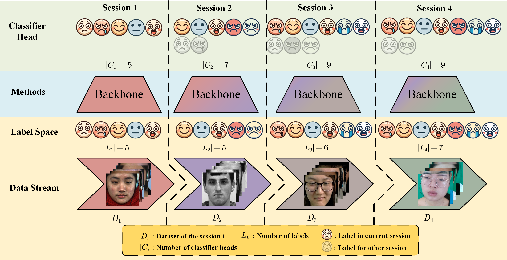

# IMER Benchmark: Incremental Learning for Micro-Expression Recognition
Micro-expression recognition plays a pivotal role in understanding hidden emotions, with applications across various fields such as psychology, security, and human-computer interaction. While traditional recognition methods assume access to all data at once, real-world scenarios often involve continuously evolving data streams. This requires models to adapt to new data while retaining knowledge from previously learned tasks, a challenge exacerbated by catastrophic forgetting.

This repository introduces a novel incremental learning framework designed specifically for micro-expression recognition. It addresses the unique complexities of the task, including overlapping and mixed categories across incremental stages. By providing a clear structure and benchmark, this repository aims to lay the foundation for future research and development in incremental micro-expression recognition.

